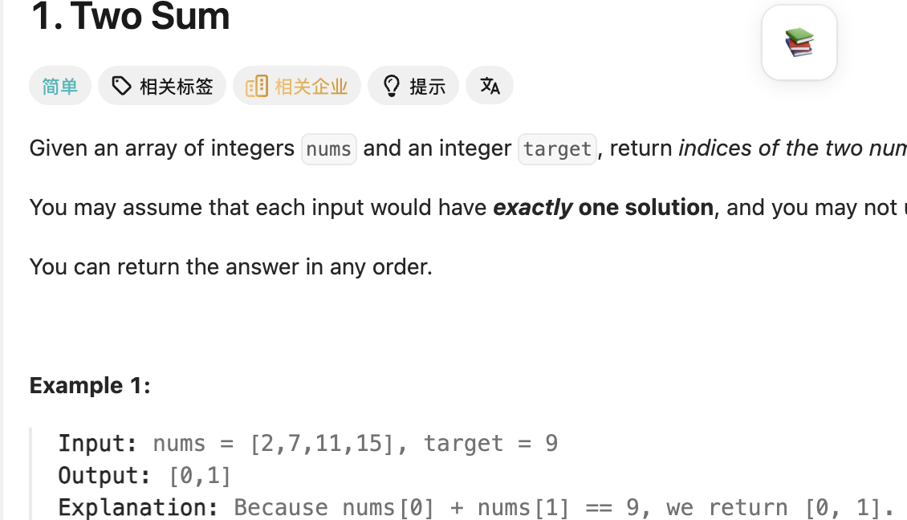
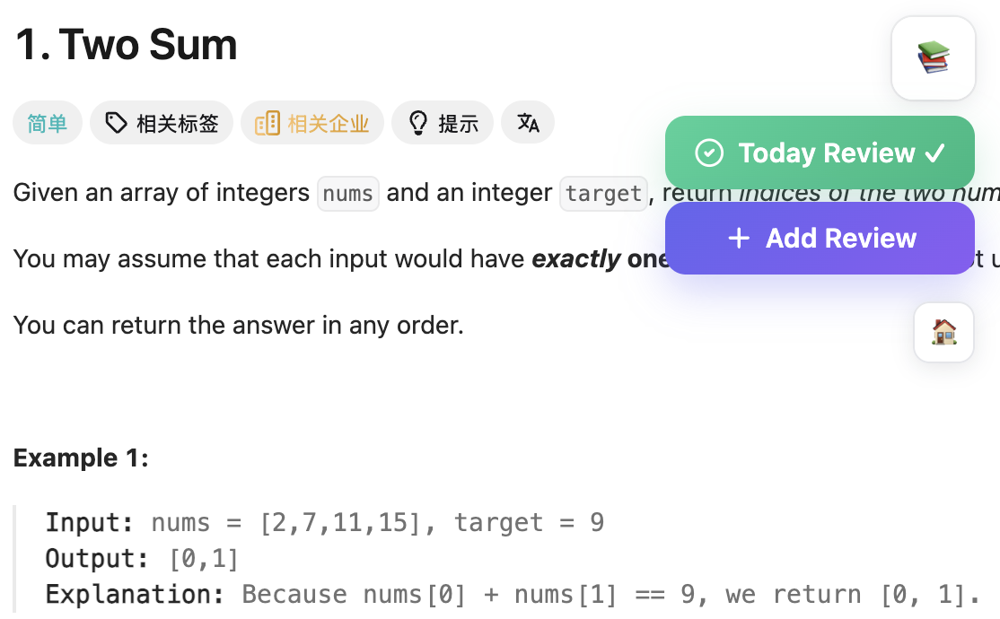
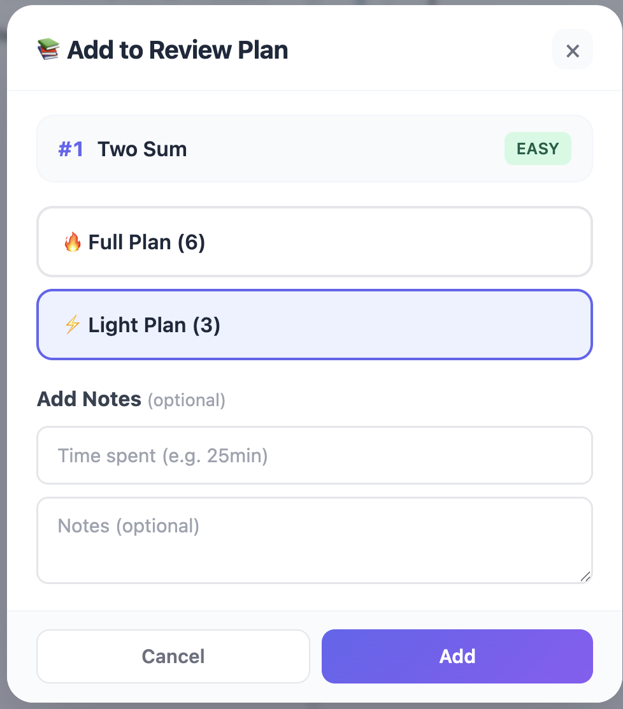
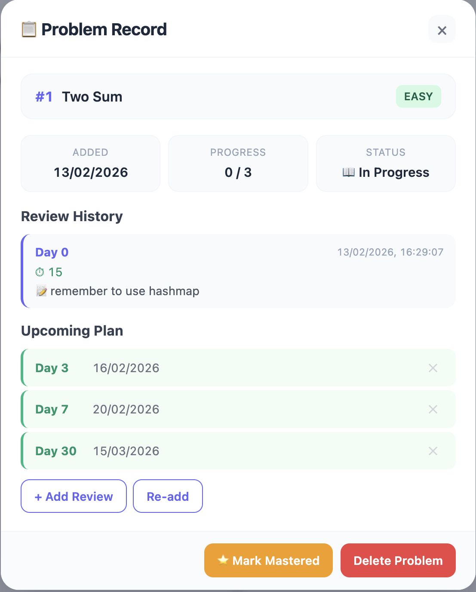
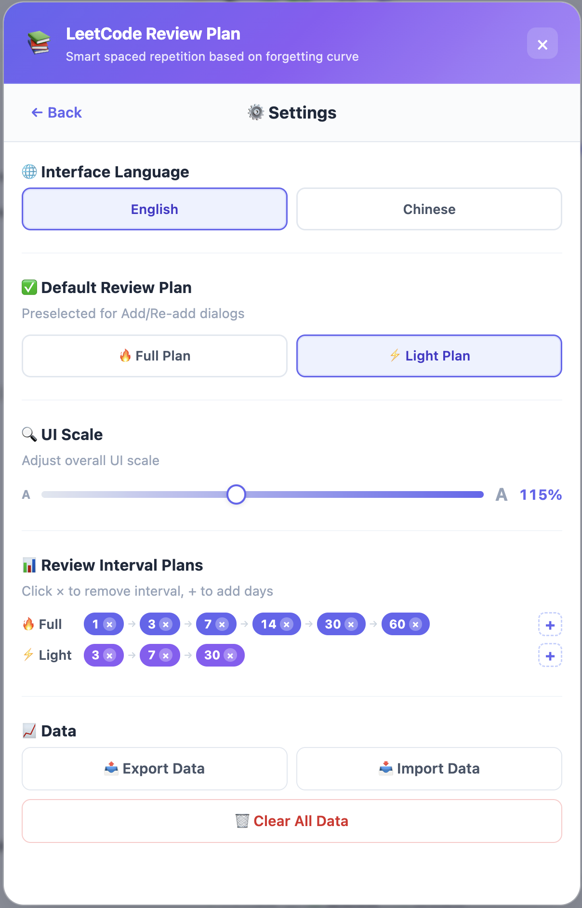

# LeetCode Review Plan - 基于遗忘曲线的 LeetCode 复习插件

[English](README.md) | [简体中文](README.zh-CN.md)

> 做过的题，不再反复“重新学”。  
> 用间隔复习把解题能力沉淀成长期记忆。

这是一个支持 `leetcode.com` 与 `leetcode.cn` 的 Chrome 插件。  
它通过遗忘曲线安排复习节奏，帮助你管理题目记录、复习历史、标签筛选和统计数据。

## ✨ 功能亮点

- 题目页右侧浮窗，**一键加入复习** / **提交复习** / **查看记录**
- 内置 `完整` / `精简` 两种复习方案，支持自定义间隔编辑
- 题目记录页可查看：加入时间、复习进度、历史笔记、后续计划
- 主页包含：今日题目、全部题目、数据统计、设置
- 支持标签搜索与筛选
- 默认英文，可切换中文
- 支持完整 JSON 导出/导入，便于备份与迁移

## 搜索关键词（便于发现）

LeetCode 复习插件，遗忘曲线，间隔复习，刷题复盘，面试准备，LeetCode Chrome 插件，spaced repetition LeetCode

## 快速开始

1. 打开 `chrome://extensions/`
2. 开启右上角 **Developer mode**
3. 点击 **Load unpacked**
4. 选择目录：`leetcode-review-helper/`

可选：
- Google Calendar 同步配置：`SETUP_GUIDE.md`
- 快速配置说明：`QUICK_START.md`

## 使用说明

1. 进入任意 LeetCode 题目页，右侧会出现浮窗入口。
2. 展开浮窗后可选择 `Add Review`、`Submit Review`、`Record`。
3. 选择 `Full` 或 `Light` 计划，并可填写用时与笔记。
4. 在 `Problem Record` 中查看历史记录与后续计划。
5. 在主页进行搜索、标签筛选和批量管理。
6. 在设置中调整语言、UI 缩放、复习间隔和数据导入导出。

### 示例截图 + 场景说明

**A）题目页入口与快捷操作**  
使用流程从题目页直接开始。先看到右侧折叠入口，展开后即可快速执行加入复习、提交复习和查看记录，避免在多个页面之间来回切换。

  
  

**B）计划设置与记录追踪**  
加入题目时可以选择完整/精简计划，并记录可选的用时与笔记。之后在记录页可以清晰查看进度、历史提交和后续复习日期，复盘路径一目了然。

  
  

**C）主页管理与个性化配置**  
主页用于日常集中管理：搜索、标签筛选、打开/提交/删除等操作都可快速完成。设置页用于长期个性化调整，包括语言、界面缩放、间隔模板和数据备份策略。

  
  

## 常见问题

### 支持 leetcode.com 和 leetcode.cn 吗？
支持，两者都可用。

### 数据安全吗？
数据保存在 Chrome 本地存储，不依赖外部用户数据服务器。

### 版本更新会丢数据吗？
建议定期使用 JSON 导出；插件支持导入恢复与迁移。

## 社区与反馈

- 如果这个项目对你有帮助，欢迎点个 Star
- 遇到问题或有建议，欢迎提 Issue
- 欢迎分享你的使用截图与学习流程

## 版本

`v2.0` · Made by Kenzie & Ethan
