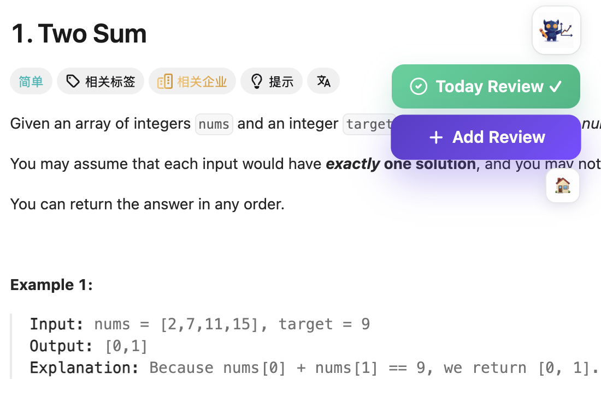
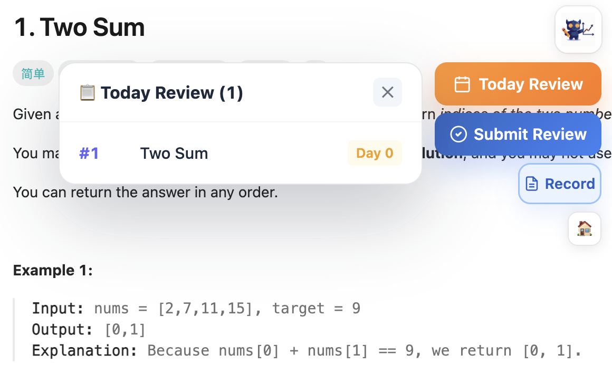
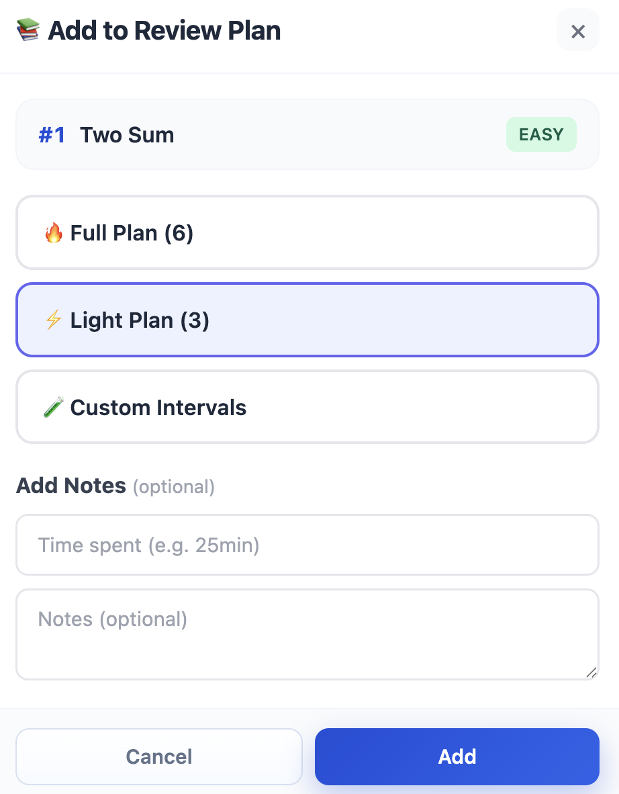
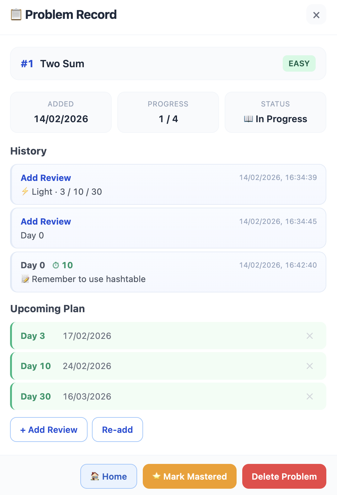
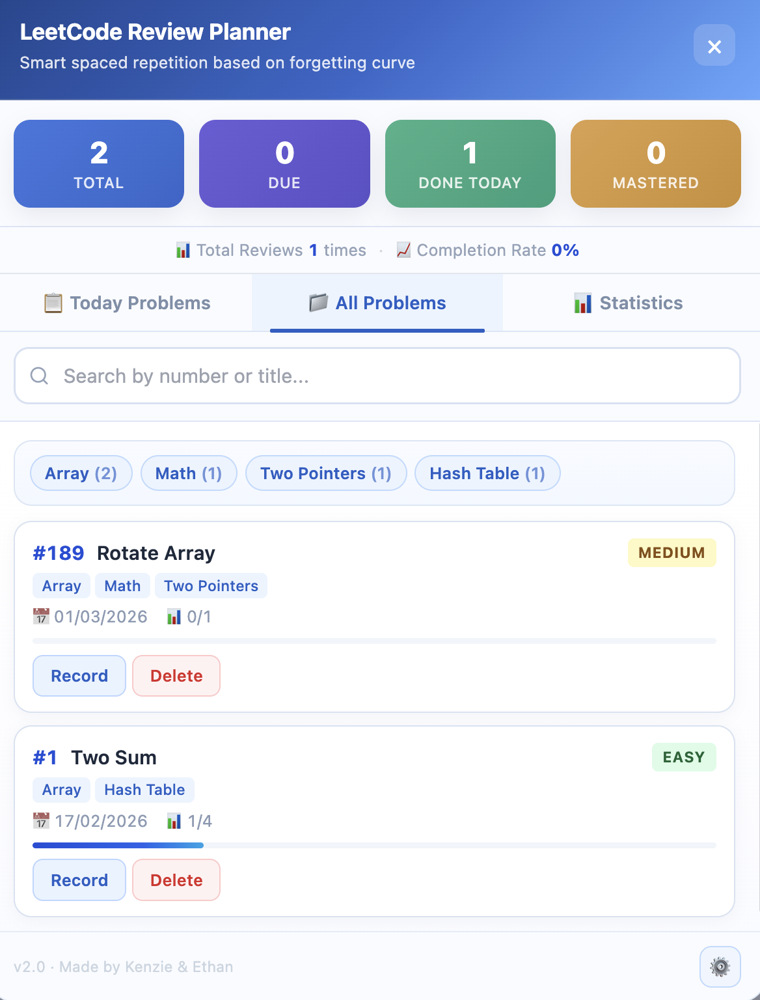
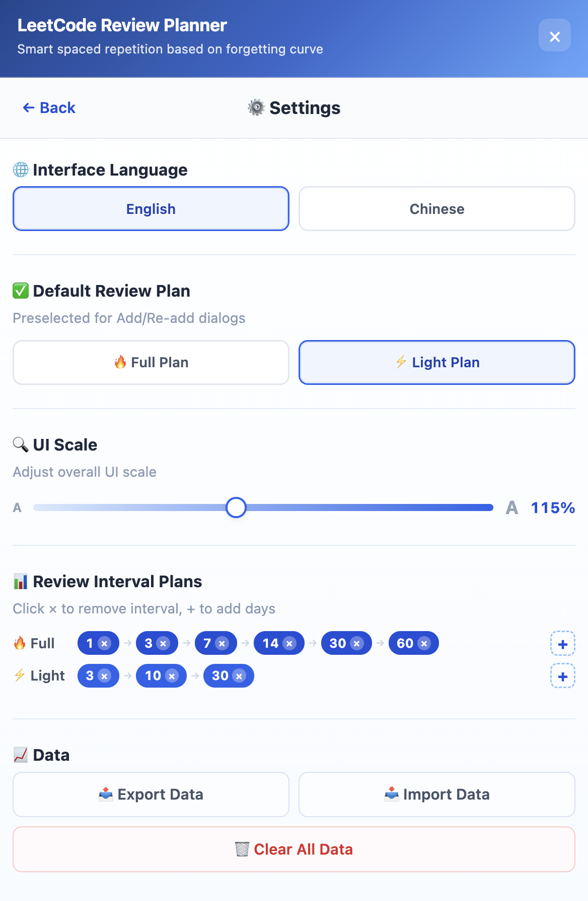
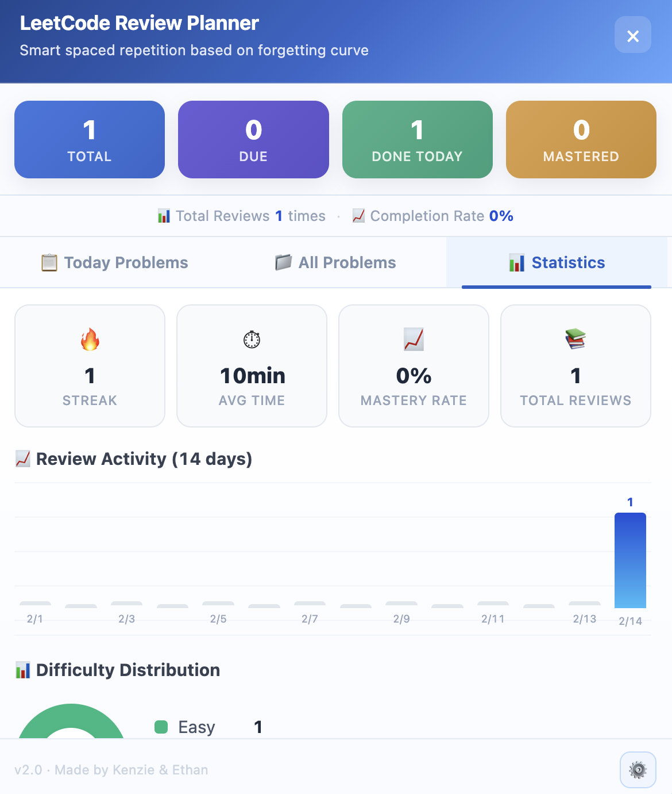

#  LeetCode Review Planner - 基于遗忘曲线的 LeetCode 复习插件

[English](README.md) | [简体中文](README.zh-CN.md)

> 做过的题，不再反复“重新学”。  
> 用间隔复习把解题能力沉淀成长期记忆。

这是一个支持 `leetcode.com` 与 `leetcode.cn` 的 Chrome 插件。  
它通过遗忘曲线安排复习节奏，帮助你管理题目记录、复习历史、标签筛选和统计数据

## 快速开始

1. 打开 `chrome://extensions/`
2. 开启右上角 **Developer mode**
3. 点击 **Load unpacked**
4. 选择目录：`leetcode-review-helper/`

## 使用说明

**A）题目页入口与快捷操作**  
使用流程从题目页直接开始。展开右侧浮窗后即可快速加入/提交复习；当日复习面板可一键跳转到当天待复习题目。

  
  

**B）计划设置与复习提交**  
加入题目时可选择完整/精简/自定义计划，并保存可选的用时与笔记；提交复习时也可在同一弹窗快速记录关键信息。

  
  

**C）记录追踪与题目管理**  
记录页可查看复习历史、笔记和后续计划；主页“全部题目”支持搜索、标签筛选与快捷操作，方便日常集中管理。

  
  

**D）个性化设置与数据统计**  
设置页可调整语言、默认计划、界面缩放和间隔模板；统计页可快速查看连续天数、平均用时、掌握率和复习活动。

  
  

## ✨ 功能亮点

- 题目页右侧浮窗，**一键加入复习** / **提交复习** / **查看记录**
- 内置 `完整` / `精简` 两种复习方案，支持自定义间隔编辑
- 题目记录页可查看：加入时间、复习进度、历史笔记、后续计划
- 主页包含：今日题目、全部题目、数据统计、设置
- 支持标签搜索与筛选
- 默认英文，可切换中文
- 支持完整 JSON 导出/导入，便于备份与迁移

## 常见问题

### 支持 leetcode.com 和 leetcode.cn 吗？
支持，两者都可用。

### 数据安全吗？
数据保存在 Chrome 本地存储，不依赖外部用户数据服务器。

### 版本更新会丢数据吗？
建议定期使用 JSON 导出；插件支持导入恢复与迁移。

## 版本

`v2.0` · Made by Kenzie & Ethan
如果这个项目对你有帮助，欢迎点个 Star
